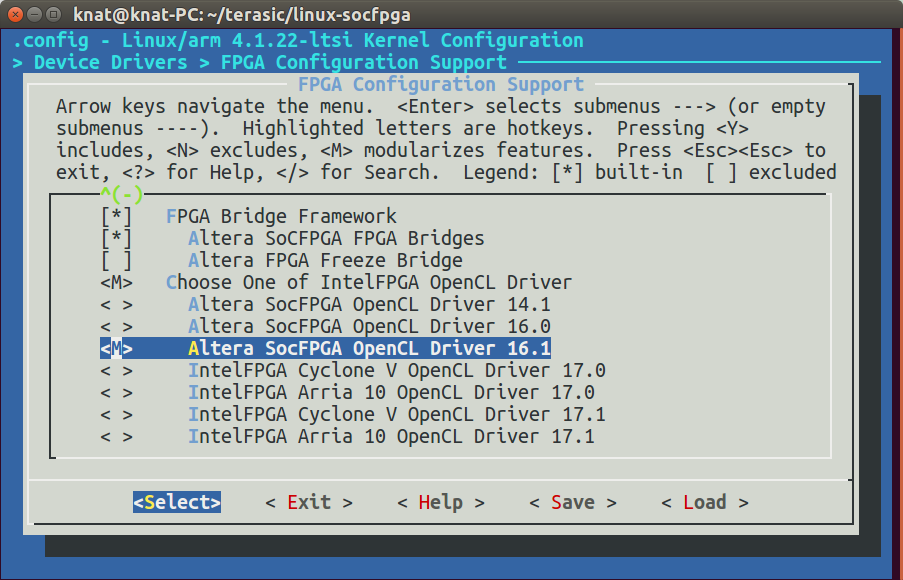

# How To Do
## Tools install & Enviroment Setting
### Windows x64

- Quartus Prime Standard Edition 16.1
- Intel FPGA SDK for OpenCL 16.1
- SoC Embedded Design Suite (EDS)

It's easy to use linux commands (arm-linux-guneabihf-gcc,make,dd) in Soc_EDS_coomand_shell.bat on windows.

More detail for Intel FPGA SDK for OpenCL 16.1,refering to [DE1SOC_OpenCL_v02.pdf](http://www.terasic.com.cn/attachment/archive/836/DE1SOC_OpenCL_v02.pdf)

### Linux (Ubuntu 16.04)

- Quartus Prime Standard Edition 16.1
- Intel FPGA SDK for OpenCL 16.1
- arm-linux-gnueabihf-gcc
- arm-linux-gnueabihf-g++
- u-boot-tools

Install tools and set BSP

	sudo apt update
	sudo apt install u-boot-tools gcc-arm-linux-gnueabihf g++-arm-linux-gnueabihf libncurses5-dev make

	wget http://www.terasic.com.cn/attachment/archive/836/DE1SOC_OpenCL_v02.pdf
	wget http://www.terasic.com/downloads/cd-rom/de1-soc/DE1_SoC_OpenCL_BSP_16.0_V1.1.zip
	unzip DE1_SoC_OpenCL_BSP_16.0_V1.1.zip
	mkdir -p ~/intelFPGA/16.1/hld/board/terasic

	cp -rf de1soc ~/intelFPGA/16.1/hld/board/terasic

	git clone https://github.com/thinkoco/de1_soc_opencl.git
	cd de1_soc_opencl 
	cp -rf de1soc_sharedonly_vga ~/intelFPGA/16.1/hld/board/terasic/de1soc
	
modify the ~/intelFPGA/16.1/hld/board/terasic/de1soc/board_env.xml file

	form : hardware dir="." default="de1soc"

	to : hardware dir="." default="de1soc_sharedonly_vga"
	
About  environment，write the following to env.sh file and change the paths for your situation. Source it using "**source env.sh**" before compiling .aocx and .rbf.

	#!/bin/bash
	export ARCH=arm
	export CROSS_COMPILE=arm-linux-gnueabihf-
	export LOADADDR=0x8000

	export ALTERAOCLSDKROOT="~/intelFPGA/16.1/hld"
	export QSYS_ROOTDIR="~/intelFPGA/16.1/quartus/sopc_builder/bin"
	export QUARTUS_ROOTDIR="~/intelFPGA/16.1/quartus"

	export PATH="$PATH:${QUARTUS_ROOTDIR}/bin:${QUARTUS_ROOTDIR}/linux64:${ALTERAOCLSDKROOT}/linux64/bin:${ALTERAOCLSDKROOT}/bin"
	export LD_LIBRARY_PATH="${ALTERAOCLSDKROOT}/linux64/lib"
	export AOCL_BOARD_PACKAGE_ROOT="${ALTERAOCLSDKROOT}/board/terasic/de1soc"
	export QUARTUS_64BIT=1
	export LM_LICENSE_FILE="~/intelFPGA/license.dat"

## Compile OpenCL Host  and Kernel

### colorGaryAPP

Compile opencl kernel command:

	cd to  xxx/de1_soc_opencl/colorGrayApp
	aoc device/grayKernel.cl -o bin/grayKernel.aocx --board de1soc_sharedonly_vga -v --report

Compile host on DE1SOC:

	cd to  xxx/de1_soc_opencl/colorGrayApp
	make

### sobel_filter_arm32

Compile opencl kernel command:

	cd to  xxx/de1_soc_opencl/sobel_filter_arm32/sobel_filter
	aoc device/sobel.cl -o bin/sobel.aocx --board de1soc_sharedonly_vga -v --report

Compile host on DE1SOC

	cd to  xxx/de1_soc_opencl/sobel_filter_arm32/sobel_filter
	make

## Linux kernel and Driver
If you want to add more kernel features,you can build your own kernel image.When update kernel,you should recompile the opencl driver and update to SD card.
*for windows, complie kernel image in Soc_EDS_coomand_shell.bat*

	git clone https://github.com/thinkoco/linux-socfpga.git
	cd linux-socfpga
	git checkout -b socfpga-opencl_4.1.22 origin/socfpga-opencl_4.1.22
	cp opencl-vga-config .config
	
	export ARCH=arm
	export CROSS_COMPILE=arm-linux-gnueabihf-
	export LOADADDR=0x8000

	make zImage
	make socfpga_cyclone5_de1soc.dtb
	make socfpga_cyclone5_de10_nano.dtb

For buliding aoc_drv.ko diver, choose "M" to select one opencl driver

	make moudles
	
	Device Drivers > FPGA Configuration Support 

## MSEL
- compression rbf (default generated top.rbf)

	quartus_cpf -c -o bitstream_compression=on top.sof opencl.rbf

	MSEL[4:0] ——> 01010， SW10(**1 to 6**) on,off,on,off,on,N/A

- no compression rbf

	quartus_cpf -c top.sof opencl.rbf

	MSEL[4:0] ——> 01000， SW10(**1 to 6**) on,on,on,off,on,N/A

## Intel FPGA SDK for OpenCL license issue on Ubuntu 16.04

**mac address of license must be eth0's mac address**

	sudo apt install lsb uml-utilities

	sudo tunctl                                           # Create the tap0 network interface
	sudo ip link set dev tap0 name eth0                   # Rename the tap0 interface to eth0
	sudo ifconfig eth0 hw ether xx:xx:xx:xx:xx:xx         # Set the MAC address for the eth0 interface
	sudo ifconfig eth0 up                                 # Bring up the eth0 interface

