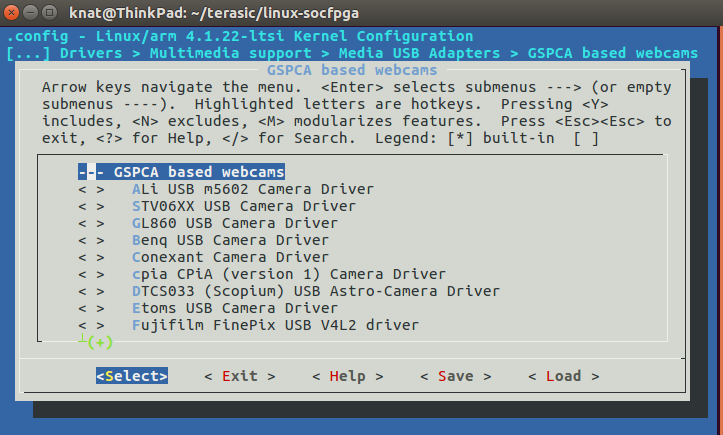

# de1_soc_opencl

##  Hardware Architecture

## Supported Boards
- [x] [DE1-SoC](http://www.terasic.com.cn/cgi-bin/page/archive.pl?Language=China&CategoryNo=182&No=870)
- [x] [DE10-Nano](http://www.terasic.com.cn/cgi-bin/page/archive.pl?Language=China&CategoryNo=203&No=1048)
- [ ] [DE0-Nano-SoC](http://www.terasic.com.cn/cgi-bin/page/archive.pl?Language=China&CategoryNo=203&No=954)

## SD Card Image file links

You can use the SD card Image files directly without building kernel and OpenCL 16.1 enviroment.

- [x] DE1-SoC [Baidu Cloud Link](http://pan.baidu.com/s/1ge6wJhp) or [Google Drive Link](https://drive.google.com/drive/folders/1Ly0_IXAf4yZpqq_qGX45RUcDkPlZyk-U)
- [x] DE10-Nano [Baidu Cloud Link](https://pan.baidu.com/s/1pNsUHSn) or [Google Drive Link](https://drive.google.com/open?id=1NGk-Dp_oo90QLhaNKBRPbdPdf7fR1IJv)

## Run OpenCL Application

1. Download  the Image fileand write it into the microSD card
2. Insert the SD card into the microSD card socket(J11)
3. MSEL[4:0] ——> 01010， SW10(**1 to 6**) on,off,on,off,on,N/A
4. For de1soc D version , use an USB cable to connect your Host PC with the UART-to-USB port (J4) on DE1-SoC.(F version no need)
5. Connect the monitor,keyboard and mouse to DE1-SoC
6. Power on DE1-SoC to boot Linux 
7. Open the kconsole (Ctrl+Alt+T) on the de1soc desktop and run OpenCL host directly. 

Some compiled binary in [compiled_bin_sdk16.1](https://github.com/thinkoco/de1_soc_opencl/tree/master/compiled_bin_sdk16.1) folder.

## Supported USB Cameras

- UVC (USB video device class) USB Cameras,for example Logitech C270

	Device Drivers > Multimedia support > Media USB Adapters
	

- USB Cameras supported by gspca driver,for example ZC301

	Drivers > Multimedia support > Media USB Adapters > GSPCA based webcams
	

## OpenCL Hardware Template
**de1soc_sharedonly_vga** is a DE1SOC's OpenCL hardware template that support VGA and desktop.Copy the file to de1soc OpenCL BSP path.
**this template also support Altera SDK for OpenCL 14.1**

**de10_nano_sharedonly_hdmi** is a DE10_nano's OpenCL hardware template (Intel FPGA SDK for OpenCL 16.1)that support VGA and desktop .
**release editon**

### colorGaryAPP
A UVC usb camera application that converting YUYV to RGB and Gray by using opencl.

Host usage:

	grayKernel -w960 -h720 
	grayKernel -w640 -h480 -r2 -g1 -b2 -u700 -d200 

### sobel_filter_arm32

do sobel by four mathods : arm , neon , opencl ,opencl with shared memory 

| Mathods              | Frequency |  Time     |
| :--------            |:---------:|:---------:|
| Cortex-A9            |900Mhz     | 168ms     |
| Neon                 | ?         | 37ms      |
| OpenCL Memory Copy   | 140Mhz    |     256ms  |
| OpenCL Shared Memory | 140Mhz    | 14.8ms    |

Host useage:

	number 1 2 3 4 5 6 different ways to run filter
	"+"  Increase filter threshold
	"="  Reset filter threshold to default
	 " q/<enter>/<esc>" Quit the program
 

## Planing

- [x] add mandelbrot application
- [x]  **update to DE10-nano**
- [ ] update template to Intel FPGA SDK for OpenCL 17.x
- [ ] add colorGaryAPP shared memory edition

## Limits

Set the CL_CONTEXT_COMPILER_MODE_ALTERA=3 flag in your host code to disable the reading of the .aocx file and the reprogramming of the FPGA.
When running desktop, copy your generated top.rbf to fat32 partition and rename to opencl.rbf.
opencl.rbf file should match the same host app and run host with CL_CONTEXT_COMPILER_MODE_ALTERA=3 flag . 

## How to do
There are some [guides](HowToDo.md).

