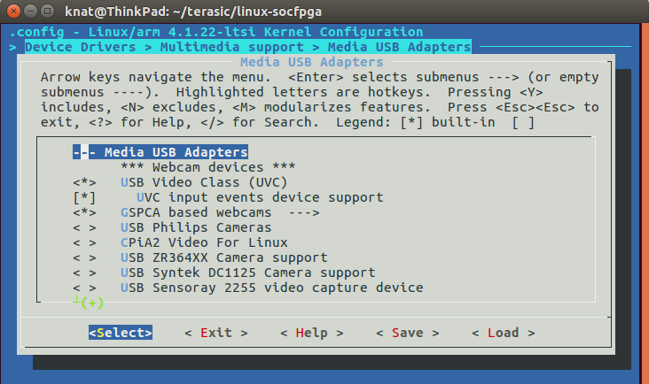

# de1_soc_opencl

##  Hardware Architecture

## Boards
Target for[DE1SoC](http://www.terasic.com.cn/cgi-bin/page/archive.pl?Language=China&CategoryNo=182&No=870).
Also,it need some modifications to run on DE10-Standard or DE10-Nano

## Supported USB Cameras

- UVC (USB video device class) USB Cameras,for example Logitech C270

	Device Drivers > Multimedia support > Media USB Adapters
	

- USB Cameras supported by gspca driver,for example ZC301

	Drivers > Multimedia support > Media USB Adapters > GSPCA based webcams
	

## OpenCL Hardware Template
**de1soc_sharedonly_vga** is a DE1SOC's OpenCL hardware template that support VGA and desktop.Copy the file to de1soc OpenCL BSP path.
**this template also support Altera SDK for OpenCL 14.1**

**de10_nano_sharedonly_hdmi** is a DE10_nano's OpenCL hardware template (Intel FPGA SDK for OpenCL 16.1)that support VGA and desktop .
**release editon**

## Run OpenCL Application

1. Wirte  the [Image file](http://pan.baidu.com/s/1ge6wJhp) into the microSD card
2. Insert the SD card into the microSD card socket(J11)
3. MSEL[4:0] ——> 01010， SW10(**1 to 6**) on,off,on,off,on,N/A
4. For de1soc D version , use an USB cable to connect your Host PC with the UART-to-USB port (J4) on DE1-SoC.(F version no need)
5. Connect the monitor,keyboard and mouse to DE1-SoC
6. Power on DE1-SoC to boot Linux 
7. Open the kconsole (Ctrl+Alt+T) on the de1soc desktop and run OpenCL host directly. 

Some compiled binary in [compiled_bin_sdk16.1](https://github.com/thinkoco/de1_soc_opencl/tree/master/compiled_bin_sdk16.1) folder.

### colorGaryAPP
A UVC usb camera application that converting YUYV to RGB and Gray by using opencl.

Host usage:

	grayKernel -w960 -h720 
	grayKernel -w640 -h480 -r2 -g1 -b2 -u700 -d200 

### sobel_filter_arm32

do sobel by four mathods : arm , neon , opencl ,opencl with shared memory 

| Mathods              | Frequency |  Time     |
| :--------            |:---------:|:---------:|
| Cortex-A9            |900Mhz     | 168ms     |
| Neon                 | ?         | 37ms      |
| OpenCL Memory Copy   | 140Mhz    |     256ms  |
| OpenCL Shared Memory | 140Mhz    | 14.8ms    |

Host useage:

	number 1 2 3 4 5 6 different ways to run filter
	"+"  Increase filter threshold
	"="  Reset filter threshold to default
	 " q/<enter>/<esc>" Quit the program

	 
## Tools install & Enviroment Setting
### Windows x64

- Quartus Prime Standard Edition 16.1
- Intel FPGA SDK for OpenCL 16.1
- SoC Embedded Design Suite (EDS)

It's easy to use linux commands (arm-linux-guneabihf-gcc,make,dd) in Soc_EDS_coomand_shell.bat on windows.

More detail for Intel FPGA SDK for OpenCL 16.1,refering to [DE1SOC_OpenCL_v02.pdf](http://www.terasic.com.cn/attachment/archive/836/DE1SOC_OpenCL_v02.pdf)

### Linux (Ubuntu 16.04)

- Quartus Prime Standard Edition 16.1
- Intel FPGA SDK for OpenCL 16.1
- arm-linux-gnueabihf-gcc
- arm-linux-gnueabihf-g++
- u-boot-tools

Install tools and set BSP

	sudo apt update
	sudo apt install u-boot-tools
	sudo apt install gcc-arm-linux-gnueabihf
	sudo apt install g++-arm-linux-gnueabihf
	sudo apt-get install libncurses5-dev makes 

	wget http://www.terasic.com.cn/attachment/archive/836/DE1SOC_OpenCL_v02.pdf
	wget http://www.terasic.com/downloads/cd-rom/de1-soc/DE1_SoC_OpenCL_BSP_16.0_V1.1.zip
	unzip DE1_SoC_OpenCL_BSP_16.0_V1.1.zip
	mkdir -p ~/intelFPGA/16.1/hld/board/terasic

	cp -rf de1soc ~/intelFPGA/16.1/hld/board/terasic

	git clone https://github.com/thinkoco/de1_soc_opencl.git
	cd de1_soc_opencl 
	cp -rf de1soc_sharedonly_vga ~/intelFPGA/16.1/hld/board/terasic/de1soc
	
modify the ~/intelFPGA/16.1/hld/board/terasic/de1soc/board_env.xml file

	form : hardware dir="." default="de1soc"

	to : hardware dir="." default="de1soc_sharedonly_vga"
	
About  environment，write the following to env.sh file and change the paths for your situation. Source it using "**source env.sh**" before compiling .aocx and .rbf.

	#!/bin/bash
	export ARCH=arm
	export CROSS_COMPILE=arm-linux-gnueabihf-
	export LOADADDR=0x8000

	export ALTERAOCLSDKROOT="~/intelFPGA/16.1/hld"
	export QSYS_ROOTDIR="~/intelFPGA/16.1/quartus/sopc_builder/bin"
	export QUARTUS_ROOTDIR="~/intelFPGA/16.1/quartus"

	export PATH="$PATH:${QUARTUS_ROOTDIR}/bin:${QUARTUS_ROOTDIR}/linux64:${ALTERAOCLSDKROOT}/linux64/bin:${ALTERAOCLSDKROOT}/bin"
	export LD_LIBRARY_PATH="${ALTERAOCLSDKROOT}/linux64/lib"
	export AOCL_BOARD_PACKAGE_ROOT="${ALTERAOCLSDKROOT}/board/terasic/de1soc"
	export QUARTUS_64BIT=1
	export LM_LICENSE_FILE="~/intelFPGA/license.dat"

## Compile OpenCL Host  and Kernel

### colorGaryAPP

Compile opencl kernel command:

	cd to  xxx/de1_soc_opencl/colorGrayApp
	aoc device/grayKernel.cl -o bin/grayKernel.aocx --board de1soc_sharedonly_vga -v --report

Compile host on DE1SOC:

	cd to  xxx/de1_soc_opencl/colorGrayApp
	make

### sobel_filter_arm32

Compile opencl kernel command:

	cd to  xxx/de1_soc_opencl/sobel_filter_arm32/sobel_filter
	aoc device/sobel.cl -o bin/sobel.aocx --board de1soc_sharedonly_vga -v --report

Compile host on DE1SOC

	cd to  xxx/de1_soc_opencl/sobel_filter_arm32/sobel_filter
	make

## SD card Image file 

You can use the SD card [Image file](http://pan.baidu.com/s/1ge6wJhp) directly without building kernel and OpenCL 16.1 enviroment.

## Linux kernel and Driver
If you want to add more kernel features,you can build your own kernel image.When update kernel,you should recompile the opencl driver and update to SD card.
*for windows, complie kernel image in Soc_EDS_coomand_shell.bat*

	git clone https://github.com/thinkoco/linux-socfpga.git
	cd linux-socfpga
	git checkout -b de1soc_opencl origin/de1_soc_opencl
	cp Linux-Config .config
	
	export ARCH=arm
	export CROSS_COMPILE=arm-linux-gnueabihf-
	export LOADADDR=0x8000

	make zImage
	make socfpga_cyclone5_de1soc.dtb

For buliding aoc_drv.ko diver, choose "M" to select opencl driver

	make moudles
	
	Device Drivers > FPGA Configuration Support 

if you bulid for ALTERA OpenCL SDK 14.1 driver,please checkout **df7d15565965112715c61266bfa3fff771bf61a1** instead of **origin/de1_soc_opencl**

	git checkout -b de1soc_opencl14 df7d15565965112715c61266bfa3fff771bf61a1

## MSEL
- compression rbf (default generated top.rbf)

	quartus_cpf -c -o bitstream_compression=on top.sof opencl.rbf

	MSEL[4:0] ——> 01010， SW10(**1 to 6**) on,off,on,off,on,N/A

- no compression rbf

	quartus_cpf -c top.sof opencl.rbf

	MSEL[4:0] ——> 01000， SW10(**1 to 6**) on,on,on,off,on,N/A

## Planing

- [x] add mandelbrot application
- [x]  **update to DE10-nano**
- [ ] update template to Intel FPGA SDK for OpenCL 17.x
- [ ] add colorGaryAPP shared memory edition

## Limits

Set the CL_CONTEXT_COMPILER_MODE_ALTERA=3 flag in your host code to disable the reading of the .aocx file and the reprogramming of the FPGA.
When running desktop, copy your generated top.rbf to fat32 partition and rename to opencl.rbf.
opencl.rbf file should match the same host app and run host with CL_CONTEXT_COMPILER_MODE_ALTERA=3 flag . 

## Intel FPGA SDK for OpenCL license issue on Ubuntu 16.04

**mac address of license must be eth0's mac adrress**

	sudo apt install lsb uml-utilities

	sudo tunctl                                           # Create the tap0 network interface
	sudo ip link set dev tap0 name eth0                   # Rename the tap0 interface to eth0
	sudo ifconfig eth0 hw ether xx:xx:xx:xx:xx:xx         # Set the MAC address for the eth0 interface
	sudo ifconfig eth0 up                                 # Bring up the eth0 interface
