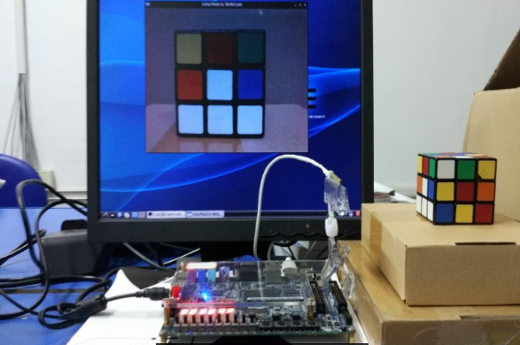
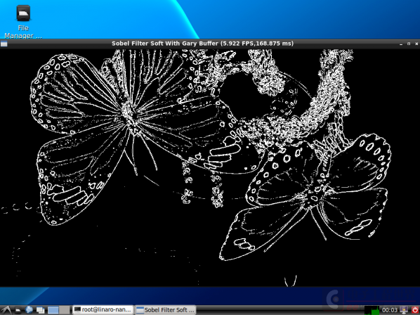

# IntelFPGA Cyclone V SoC OpenCL

##  Hardware Architecture

## Supported Boards
- [x] [DE1-SoC](http://www.terasic.com.cn/cgi-bin/page/archive.pl?Language=China&CategoryNo=182&No=870)
- [x] [DE10-Nano](http://www.terasic.com.cn/cgi-bin/page/archive.pl?Language=China&CategoryNo=203&No=1048)
- [x] [DE10-Standard](http://www.terasic.com.cn/cgi-bin/page/archive.pl?Language=China&CategoryNo=182&No=1105)

## Supported USB Cameras

- UVC (USB video device class) USB Cameras,for example Logitech C270
- USB Cameras supported by gspca driver
- etc.

## SD Card Image Features

- **now,FPGA reconfigurable** (c5soc_opencl_lxde_fpga_reconfigurable.img only)
- both IntelFPGA OpenCL SDK 16.1 and 17.1
- ubuntu 16.04 and 18.04 root file system
- LXDE desktop
- support x2go server (run desktop through ethernet)
- also working with terasic's OpenCL hardware template BSP(x2go only with no vedio ip core,[see here](HowToRunX2GO.md))
- also working without OpenCL
- All in one ( DE1-SoC , DE10-Nano and DE10-Standard)
- usb host and uvc driver for UVC cameras

You can downlaod the all in one SD card Image file here [Baidu Cloud Link](https://pan.baidu.com/s/1KDyexwHD39uyvcMDm0G97A) or [Google Drive Link](https://drive.google.com/open?id=1mAYHFvOw2xtgf-e8pntFCxCGOdaYNsgG).

## Run OpenCL Application

1. Download the Image file and write it into the microSD card
2. Cpoy the BOARD_NAME_APP.rbf and BOARD_NAME_socfpga.dtb ( keep the BOARD_NAME same as your target board) to Windows fat32 partition and rename them to opencl.rbf and socfpga.dtb 
3. Insert the programmed microSD card to the DE10-nano or DE1-SoC or DE10-Standard board 
4. Set the MSEL[4:0] on your board to 01010 , SW10(**1 to 6**) on,off,on,off,on,N/A
5. Connect a  monitor to the HDMI or VGA port on baord
6. Conect USB mouse and keyboard to the USB ports on the board
7. Conect UART to PC (**must conect to PC or Power**)
8. Power on the board and you will see the LXDE graphical environment
9. Open the console (Ctrl+Alt+T) on the desktop 
10. source the **init_opencl_16.1.sh** or  **init_opencl_17.1.sh** file 
11. run OpenCL host (which keep same as your target board and the OpenCL SDK version ) directly. 

## OpenCL Hardware Template

**Both supports IntelFPGA SDK for OpenCL 16.1 and 17.1**

| Target Board      | Hardware Template  wtih VIP core | terasic's Hardware Template |
| :--------         |:---------                        |:----------------------------|
| DE1SOC            | de1soc_sharedonly_vga            |de1soc_sharedonly            |
| DE10-nano         | de10_nano_sharedonly_hdmi        | de10_nano_sharedonly        |
| DE10-Standard     | de10_standard_sharedonly_vga     | de10_standard_sharedonly    |

## App
### colorApp
A UVC usb camera application program is used to convert YUYV to RGB and Gray by using opencl.

Host usage:

	colorApp.run -w960 -h720 
	colorApp.run -w640 -h480 -r2 -g1 -b2 -u700 -d200 

### camera_sobel
YUYV --> Y(gray) --> sobel 

	camera_sobel.run -h  //"-h" hardware mode

### sobel_filter

do sobel by using four methods : arm , neon , opencl ,opencl with shared memory

| Methods              | Frequency |  Time     |
| :--------            |:---------:|:---------:|
| Cortex-A9            | 800Mhz    | 168ms     |
| Neon                 | ?         | 37ms      |
| OpenCL Memory Copy   | 140Mhz    | 256ms     |
| OpenCL Shared Memory | 140Mhz    | 14.8ms    |

Host useage:

	number 1 2 3 4 5 6 different ways to run filter
	"+"  Increase filter threshold
	"="  Reset filter threshold to default
	 " q/<enter>/<esc>" Quit the program

### Mandelbrot

Host useage:

	mandelbrot -w=800 -h=640 -c=32

## Plans

- [x] add mandelbrot application
- [x] add to DE10-nano BSP
- [x] update template to Intel FPGA SDK for OpenCL 17.x
- [x] add DE10-Standard BSP
- [x] add colorGaryAPP shared memory edition
- [x] add camera sobel application
- [x] guides for building SD card image

## Limits

Set the CL_CONTEXT_COMPILER_MODE_ALTERA=3  (opencl sdk16.1 ) flag in environment to disable the reprogramming of the FPGA by host. When running desktop, copy your generated top.rbf to fat32 partition and rename to opencl.rbf. opencl.rbf file should match the same host app and run host with CL_CONTEXT_COMPILER_MODE_ALTERA=3 flag .

CL_CONTEXT_COMPILER_MODE_INTELFPGA=3 (opencl sdk17.1)

## How to do
1. [How to do](HowToDo.md)

2. [How to Run x2go](HowToRunX2GO.md)

3. [How to build your own BSP](HowToBuildBSP.md)

4. [How to update opencl driver](HowToBuildOpenCLDriver.md)

5. [How to do fpga reconfiguration](HowToReconfigureFPGA.md)

5. [How to build SD card Image](HowToBuildSDImage.md)
